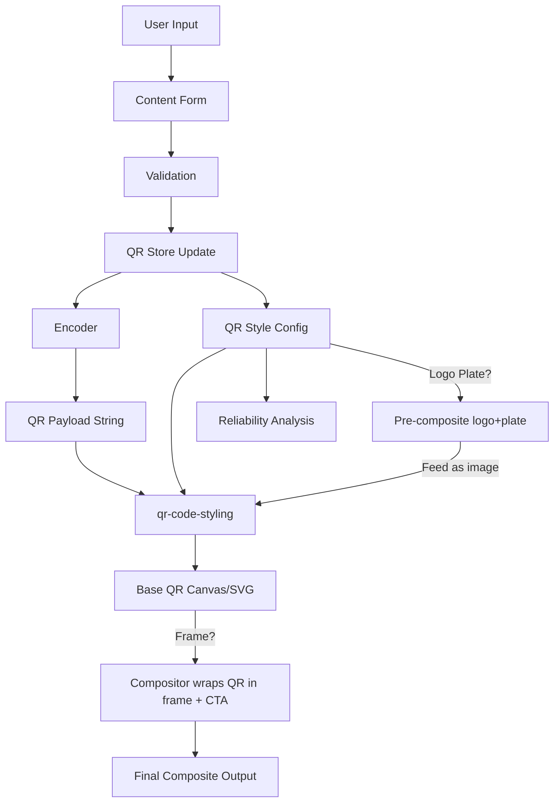
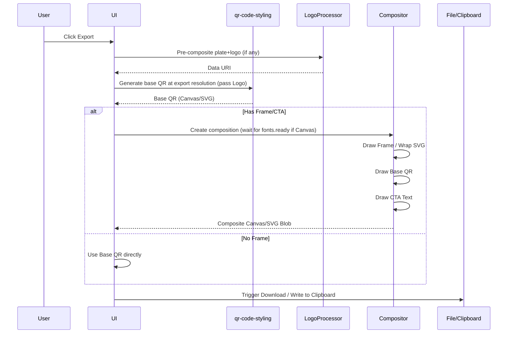
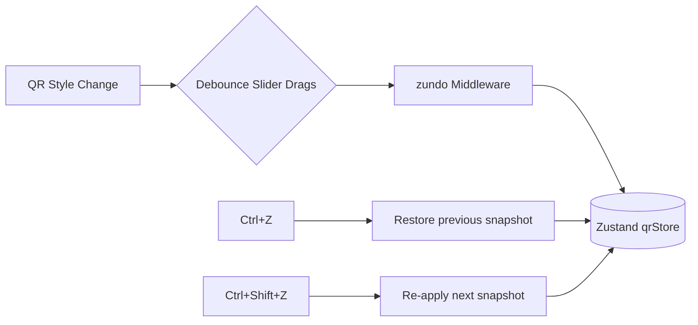

# QRaft Architecture

## Overview

QRaft is a modern, browser-based QR code generator built with React, TypeScript, and Vite. It provides a highly customizable, privacy-first (100% client-side) QR generation experience. This document outlines the application architecture, directory structure, data flows, and state management strategies, reflecting the full QR customization surface.

## Architecture Principles

1. **qr-code-styling handles:** dots, corners, colors, gradients, background, logo (centered), error correction, margin.
2. **Qraft compositor handles:** frames, CTA text, logo plates (pre-composited before passing to library).
3. **Two-layer rendering:** Base QR (library) → Composition (Qraft wrapper).
4. **Export consistency:** Preview and export use the same composition pipeline, just at different resolutions.
5. **Client-side only:** All QR generation, processing, and rendering happens entirely in the browser.
6. **Decoupled Business Logic:** Domain logic (payload encoding, validation, reliability scoring) is kept completely separate from UI components.

## Tech Stack

- **Framework:** React 18+ (via Vite)
- **Language:** TypeScript
- **Styling:** Tailwind CSS + Radix UI (Primitives) / shadcn/ui
- **State Management:** Zustand (with `zundo` middleware for Undo/Redo)
- **Form Handling:** React Hook Form + Zod
- **QR Code Engine:** `qr-code-styling` (wrapped & extended)
- **Icons:** Lucide React

## Core Systems & New Features

### 1. Frame System (Qraft Wrapper)
The frame system is a custom composition layer built *around* the base `qr-code-styling` output.
- **Rendering Strategy:** Frames are rendered as a composition layer AROUND the QR code.
- **SVG Export:** Uses a parent `<svg>` with frame elements, nesting the base QR `<g>` inside with an offset.
- **Canvas/PNG Export:** Uses an off-screen composition canvas. It draws the frame first, then `drawImage` applies the generated QR.
- **Quiet Zone:** The frame system automatically preserves the quiet zone (padding) between the frame edge and the QR code matrix.

### 2. CTA Text
Call-to-Action (CTA) text is integrated seamlessly into the frame/composition layer.
- **Canvas Rendering:** Uses `ctx.fillText()`. The system **must** await `document.fonts.ready` before rendering to ensure custom fonts are applied correctly to the rasterized output.
- **SVG Rendering:** Implemented natively via `<text>` elements.
- **Font Handling:** Leverages loaded web fonts (e.g., Inter, JetBrains Mono) or system fallback fonts.

### 3. Logo Plates
To ensure logos remain visible against complex backgrounds, they are nested in plates.
- **Processing:** The logo and its chosen plate (shape) are pre-composited in an off-screen canvas.
- **Integration:** The resulting composite image is converted to a Data URI and fed directly into `qr-code-styling`'s image option.
- **Shapes Supported:** Circle, Rounded Square, Square.

### 4. Undo/Redo System
- **State Store:** Implemented using Zustand paired with the `zundo` middleware attached to the QR configuration store.
- **Debouncing:** Rapid changes, such as dragging a size slider, are debounced so they register as a single grouped undo step rather than flooding the history.
- **Limits:** Stores a maximum of ~50 history steps to conserve memory.
- **Shortcuts:** Listens globally for `Ctrl+Z` (Undo) and `Ctrl+Shift+Z` (Redo).

### 5. Design Randomizer ("Surprise Me")
- **Palette Strategy:** Uses curated, pre-vetted color palettes rather than pure randomness to ensure output always passes contrast checks.
- **Forced Safety:** Automatically forces Error Correction to 'H' (Highest) for randomized designs to maintain scannability.
- **Randomized Elements:** Dot type, corner types, colors, and gradients.
- **Preserved Elements:** Does NOT randomize the frame (too structurally complex) or the logo (which is user/brand-specific).

## Data Flow

### QR Generation + Composition Flow



### Export Flow



### Undo/Redo Flow



## Directory Structure

### `domain/`
Core business logic, free of UI dependencies.
```text
domain/
├── types.ts                  # All types (expanded)
├── constants.ts              # Defaults, limits
├── encoders/                 # QR payload encoders (URLs, VCard, WiFi, etc.)
├── validators/               # Input validation schemas (Zod)
├── reliability/              # Scan reliability checks
│   ├── index.ts
│   ├── contrast.ts
│   ├── quietZone.ts
│   ├── errorCorrection.ts
│   ├── logo.ts
│   ├── moduleStyle.ts
│   ├── gradient.ts           # gradient contrast checks
│   └── frame.ts              # frame quiet zone checks
├── presets/                  # Built-in presets
│   ├── index.ts
│   ├── builtInPresets.ts
│   └── palettes.ts           # curated design palettes for randomizer
├── randomizer/               # Design randomizer logic
│   ├── index.ts
│   └── palettes.ts
└── history/                  # Undo/redo core logic definitions
```

### `features/generator/`
Feature-specific React components and hooks.
```text
features/generator/
├── components/
│   ├── GeneratorPage.tsx
│   ├── ContentTypeSelector.tsx
│   ├── ContentForms/
│   ├── StylePanel/                   # Customization UI
│   │   ├── StylePanel.tsx            # Main wrapper
│   │   ├── PatternSection.tsx        # Dot/module shape picker
│   │   ├── EyeSection.tsx            # Corner square + corner dot styling
│   │   ├── ColorSection.tsx          # All color controls
│   │   ├── GradientSection.tsx       # Gradient configuration
│   │   ├── LogoSection.tsx           # Logo upload, size, plate
│   │   ├── FrameSection.tsx          # Frame style, colors, CTA
│   │   ├── SizeSection.tsx           # Width, height, margin
│   │   └── ErrorCorrectionSection.tsx
│   ├── PresetSelector.tsx
│   ├── QRPreview.tsx
│   ├── ExportActions.tsx
│   ├── ReliabilityIndicator.tsx
│   └── RandomizeButton.tsx           # "Surprise Me" feature
├── hooks/
│   ├── useQRCode.ts
│   ├── useQRExport.ts
│   ├── useQRCompositor.ts           # frame + CTA + logo plate composition
│   ├── useLogoPlate.ts              # off-screen logo plate rendering
│   └── useDebounce.ts
```

### `lib/`
Integration layers and utility wrappers.
```text
lib/
├── qrCodeStyling.ts          # qr-code-styling wrapper
├── compositor.ts             # Canvas/SVG composition for frames + CTA
├── logoProcessor.ts          # logo plate compositing, resize
├── storage.ts                # LocalStorage management
└── fontLoader.ts             # ensures fonts are loaded before canvas export
```

### `stores/`
Zustand global state containers.
```text
stores/
├── qrStore.ts               # QR config (with zundo middleware for undo/redo)
├── historyStore.ts          # History entries (scans, generated links)
├── themeStore.ts            # UI Theme preferences (light/dark)
└── uiStore.ts               # General UI state (modals, toasts)
```

## Component Hierarchy

```text
App
├── Header
│   ├── Logo
│   ├── UndoRedoButtons         # Trigger Ctrl+Z / Ctrl+Shift+Z equivalent
│   ├── RandomizeButton         # "Surprise Me" action
│   ├── HistoryToggle
│   └── ThemeToggle
│
├── GeneratorPage
│   ├── InputPanel
│   │   ├── ContentTypeSelector # URL, Text, WiFi, etc.
│   │   └── ContentForm         # Contextual form fields based on type
│   │
│   ├── CustomizationPanel
│   │   ├── PresetSelector      # Horizontal scroll of saved/built-in templates
│   │   ├── StylePanel          # Accordion sections
│   │   │   ├── PatternSection
│   │   │   ├── EyeSection      # corner square + corner dot
│   │   │   ├── ColorSection    # dot color, eye colors, background
│   │   │   ├── GradientSection # dot gradient, background gradient
│   │   │   ├── SizeSection     # width, margin
│   │   │   ├── ErrorCorrectionSection
│   │   │   ├── LogoSection     # upload, size, plate
│   │   │   └── FrameSection    # style, colors, CTA text
│   │   └── ReliabilityIndicator# Scannability score
│   │
│   └── PreviewPanel
│       ├── QRPreview           # Renders base QR inside Composer if framed
│       └── ExportActions       # Download PNG/SVG/Copy
│
├── HistoryPanel                # Slide-out or separate route for past QRs
│
└── Footer
```

## State Management

We use **Zustand** as the primary state manager due to its minimal boilerplate and excellent React hook integration.

- `useQRStore`: The single source of truth for the active QR code configuration.
  - Initialized with default settings.
  - Wrapped with `zundo` middleware to track `pastStates` and `futureStates`.
  - Actions that update this store (like slider drags) are debounced appropriately via custom hooks (`useDebounce`) or within the UI layer before calling the setter, to avoid polluting the undo stack.
- `useUIStore`: Manages ephemeral UI states like whether a specific accordion is open or if the export modal is visible.
- `useThemeStore`: Persists dark/light mode preferences.
