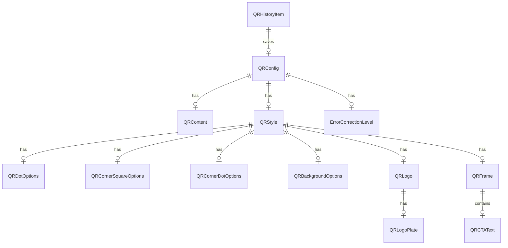

# QRaft Data Model

This document outlines the core data model and type definitions for QRaft, expanding on the capabilities of the underlying `qr-code-styling` library and adding Qraft-specific wrapper features (Frames, CTA text, advanced logo handling).

## Type Definitions

```typescript
// === Content Types ===
type QRContentType = 'url' | 'text' | 'email' | 'phone' | 'wifi';

type QRContent = URLContent | TextContent | EmailContent | PhoneContent | WiFiContent;

interface URLContent { type: 'url'; url: string; }
interface TextContent { type: 'text'; text: string; }
interface EmailContent { type: 'email'; to: string; subject?: string; body?: string; cc?: string; bcc?: string; }
interface PhoneContent { type: 'phone'; number: string; }
interface WiFiContent { type: 'wifi'; ssid: string; password: string; authType: 'WPA' | 'WEP' | 'nopass'; hidden: boolean; }

// === Error Correction ===
type ErrorCorrectionLevel = 'L' | 'M' | 'Q' | 'H';

// === Module/Dot Shapes ===
type QRDotType = 'square' | 'dots' | 'rounded' | 'classy' | 'classy-rounded' | 'extra-rounded';

// === Corner Square (Eye Frame) Shapes ===
type QRCornerSquareType = 'square' | 'dot' | 'extra-rounded' | 'dots' | 'rounded' | 'classy' | 'classy-rounded';

// === Corner Dot (Eye Pupil) Shapes ===
type QRCornerDotType = 'square' | 'dot';

// === Gradient ===
interface QRGradient {
  type: 'linear' | 'radial';
  rotation?: number;  // radians for linear gradient
  colorStops: Array<{ offset: number; color: string }>;  // offset 0-1
}

// === Dot/Module Options ===
interface QRDotOptions {
  type: QRDotType;
  color: string;       // hex color
  gradient?: QRGradient;
}

// === Corner Square (Eye Frame) Options ===
interface QRCornerSquareOptions {
  type: QRCornerSquareType;
  color?: string;       // defaults to dot color if not set
  gradient?: QRGradient;
}

// === Corner Dot (Eye Pupil) Options ===
interface QRCornerDotOptions {
  type: QRCornerDotType;
  color?: string;       // defaults to corner square color if not set
  gradient?: QRGradient;
}

// === Background Options ===
interface QRBackgroundOptions {
  color: string;         // hex color, or 'transparent'
  gradient?: QRGradient;
  round?: number;        // border-radius in px for rounded background
}

// === Logo / Image ===
interface QRLogoPlate {
  enabled: boolean;
  shape: 'circle' | 'rounded-square' | 'square';
  color: string;       // plate background color
  padding: number;     // padding around logo within plate (px)
}

interface QRLogo {
  src: string;                   // data URL (for persistence) or blob URL (session)
  size: number;                  // 0-0.4 ratio relative to QR size
  margin: number;                // px margin around logo/plate
  hideBackgroundDots: boolean;   // excavate modules behind logo
  opacity?: number;              // 0-1, default 1
  plate?: QRLogoPlate;           // optional background plate
}

// === Frame ===
type QRFrameStyle = 'none' | 'simple' | 'rounded' | 'badge' | 'banner' | 'ticket';

interface QRFrame {
  style: QRFrameStyle;
  color: string;          // frame border/line color
  backgroundColor: string; // frame fill color
  borderWidth: number;     // px
  borderRadius: number;    // px
  padding: number;         // px between frame edge and QR
  ctaText?: QRCTAText;    // optional call-to-action text
}

// === CTA Text ===
interface QRCTAText {
  text: string;                   // e.g., 'SCAN ME', 'VIEW MENU'
  position: 'top' | 'bottom';    // relative to QR within frame
  fontFamily: 'Inter' | 'JetBrains Mono' | 'system';  // limited to loaded fonts
  fontWeight: 400 | 500 | 600 | 700;
  fontSize: number;               // px
  letterSpacing: number;           // px
  color: string;                   // hex
  alignment: 'left' | 'center' | 'right';
}

// === Complete QR Style ===
interface QRStyle {
  // Size & Layout
  width: number;          // px, e.g., 300
  height: number;         // px, usually same as width
  margin: number;         // quiet zone in px (not modules)
  
  // Dots/Modules
  dotOptions: QRDotOptions;
  
  // Finder Pattern Eyes
  cornerSquareOptions: QRCornerSquareOptions;
  cornerDotOptions: QRCornerDotOptions;
  
  // Background
  backgroundOptions: QRBackgroundOptions;
  
  // Logo
  logo?: QRLogo;
  
  // Frame (Qraft wrapper, not qr-code-styling native)
  frame?: QRFrame;
}

// === Complete QR Config ===
interface QRConfig {
  content: QRContent;
  style: QRStyle;
  errorCorrection: ErrorCorrectionLevel;
}

// === Presets ===
interface QRPreset {
  id: string;
  name: string;
  description: string;
  category: 'basic' | 'professional' | 'creative' | 'branded';
  style: Partial<QRStyle>;   // partial overrides
  errorCorrection?: ErrorCorrectionLevel;
  isBuiltIn: boolean;
}

// === History ===
interface QRHistoryItem {
  id: string;              // crypto.randomUUID()
  config: QRConfig;
  createdAt: number;       // Unix timestamp ms
  label?: string;          // auto-generated from content
  presetId?: string;
}

interface PersistedHistory {
  version: number;
  items: QRHistoryItem[];
}

// === Validation ===
interface QRFieldError {
  field: string;
  message: string;
  severity: 'error' | 'warning';
}

interface QRValidationResult {
  isValid: boolean;
  errors: QRFieldError[];
}

// === Reliability ===
type ReliabilitySeverity = 'good' | 'warning' | 'danger';

interface QRReliabilityCheck {
  id: string;
  factor: string;
  label: string;
  passed: boolean;
  severity: ReliabilitySeverity;
  detail?: string;
  recommendation?: string;
}

interface QRReliabilityReport {
  overallScore: ReliabilitySeverity;
  checks: QRReliabilityCheck[];
}

// === Undo/Redo State ===
// Managed by zundo middleware on the QR store
// No separate type needed — zundo wraps the store state

// === Theme ===
interface PersistedTheme {
  mode: 'light' | 'dark' | 'system';
}

// === Design Randomizer ===
interface QRDesignPalette {
  id: string;
  name: string;
  dotOptions: Partial<QRDotOptions>;
  cornerSquareOptions?: Partial<QRCornerSquareOptions>;
  cornerDotOptions?: Partial<QRCornerDotOptions>;
  backgroundOptions?: Partial<QRBackgroundOptions>;
  errorCorrection?: ErrorCorrectionLevel;
}
```

## Entity Relationship Diagram



## Default Values

| Entity / Property | Default Value | Notes |
| :--- | :--- | :--- |
| **QRConfig.content** | `{ type: 'url', url: 'https://qraft.app' }` | Starting state |
| **QRConfig.errorCorrection** | `'Q'` | 25% error correction capacity, good balance |
| **QRStyle.width / height** | `300` | Minimum recommended baseline |
| **QRStyle.margin** | `0` | Quiet zone for the library |
| **QRDotOptions** | `{ type: 'square', color: '#000000' }` | |
| **QRCornerSquareOptions** | `{ type: 'square', color: '#000000' }` | Inherits from dots if not set |
| **QRCornerDotOptions** | `{ type: 'square', color: '#000000' }` | Inherits from corner square if not set |
| **QRBackgroundOptions** | `{ color: '#FFFFFF' }` | |

## Mapping to `qr-code-styling` vs Qraft Wrappers

| QRaft Model Path | Maps to `qr-code-styling` option | Is Qraft Wrapper Feature | Note |
| :--- | :--- | :--- | :--- |
| `style.dotOptions` | `dotsOptions` | No | |
| `style.cornerSquareOptions` | `cornersSquareOptions` | No | |
| `style.cornerDotOptions` | `cornersDotOptions` | No | |
| `style.backgroundOptions` | `backgroundOptions` | No | |
| `style.logo.src` | `image` | No | Handled natively |
| `style.logo.size` | `imageOptions.imageSize` | No | Relative 0-1 scalar |
| `style.logo.margin` | `imageOptions.margin` | No | |
| `style.logo.hideBackgroundDots` | `imageOptions.hideBackgroundDots` | No | |
| `style.logo.plate` | **N/A** | Yes | Qraft composites logo onto plate via offscreen canvas before feeding to lib |
| `style.frame` | **N/A** | Yes | Drawn as SVG/Canvas layers around the generated QR |
| `style.frame.ctaText` | **N/A** | Yes | Rendered by Qraft within the frame container |
| `errorCorrection` | `qrOptions.errorCorrectionLevel` | No | |

### Wrapper Architecture Notes

- **Frames & CTA:** These are strictly wrapper features. `qr-code-styling` only handles the core matrix. QRaft renders the QR code, then nests it inside an outer frame component where the CTA is drawn.
- **Logo Plates:** Since `qr-code-styling` only supports an `image` URL/string, Qraft performs a pre-composition step: creating a mini-canvas, drawing the requested shape (circle/square) plate, rendering the logo over it, and converting that composite to a Data URI, which is then fed into `qr-code-styling`.

## Serialization and Persistence

- **Logos:** For session states, use `blob:` URLs for speed. When saving to `History` or `Local Storage`, user-uploaded images MUST be converted to `data:` URIs (base64) so they persist across sessions. Note: Ensure reasonable file size limits on upload to avoid bloat.
- **Gradients:** The `rotation` property in `QRGradient` expects values in **radians** (e.g. `Math.PI / 4` for 45 degrees). When building UI controls (like a 360-degree dial), convert degrees to radians before pushing state to the QR generator.

## Migration Strategy (Local Storage)

Since users might have existing saved histories in older formats:
1. **Version Tying:** Always attach a `version` integer to the root of persisted states. 
2. **Upgrader Functions:** When loading history, check `version`. If older, run the data through an upgrader function (`v1_to_v2`, etc.) before initializing the Zustand store.
3. **Safe Fallbacks:** Any missing fields should gracefully fall back to the defaults mentioned in the table above.
